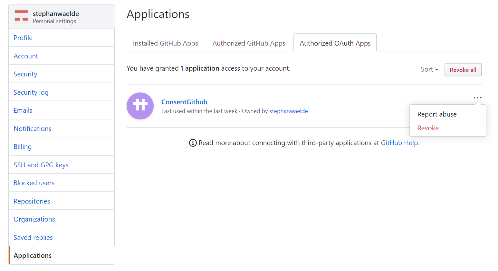

# ConsentGithub

This web app was written as an exercise to understand the OAuth2 authorization code grant flow with Github identities. It is based on the sample code from Aaron Parecki at https://github.com/aaronpk/sample-oauth2-client.

It can be tested with any Github account. This web app will list the public repositiories once it has been given access permission. This is the permission the web app will request:

The permissions can be revoked in the Github settings:

