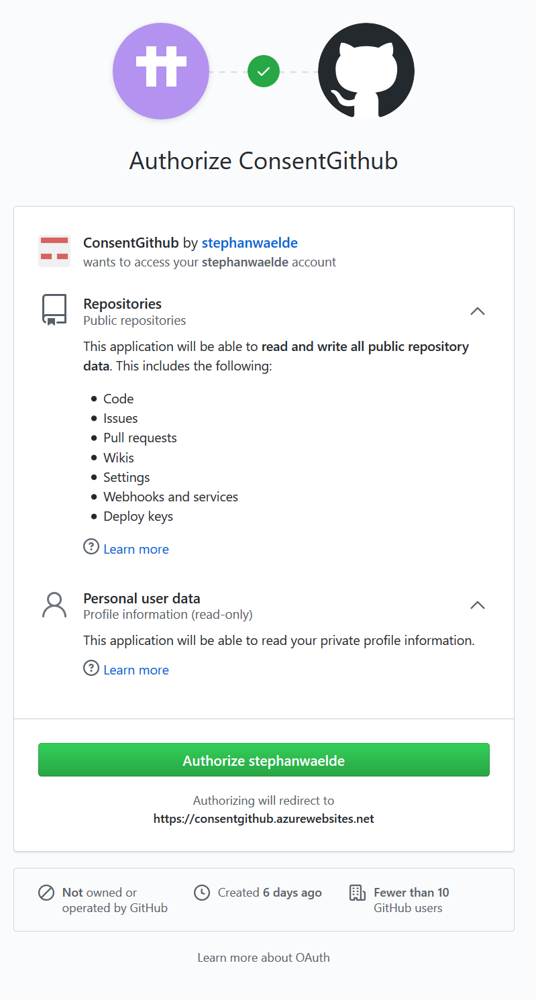

# ConsentGithub

This web app was written as an exercise to understand the OAuth2 authorization code grant flow with Github identities. It is based on the sample code from Aaron Parecki at https://github.com/aaronpk/sample-oauth2-client

You can test it if you have a Github account. This web app will list your public repositiories once you have given it access permission. This is the permission the web app will request:

You can revoke the permissions in the Github settings:

